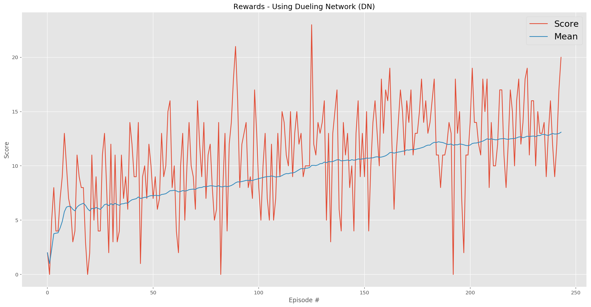
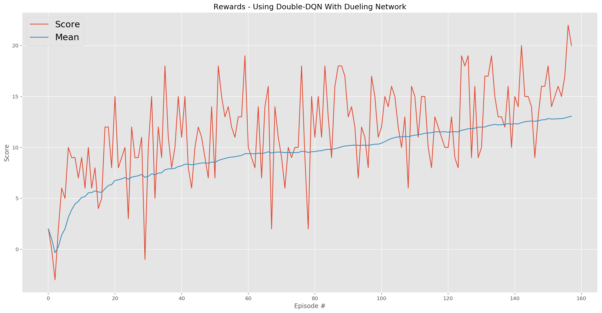

# Deep Reinforcement Learning: Navigation (Report)

[](https://twitter.com/youldash)

## License

By using this site, you agree to the **Terms of Use** that are defined in [LICENSE](https://github.com/youldash/DRL-Navigation/blob/master/LICENSE).

## Algorithm Implementations

As mentioned in the [`README.md`](https://github.com/youldash/DRL-Navigation/blob/master/README.md) file of this repo, The project was developed in partial fulfillment of the requirements for Udacity's [Deep Reinforcement Learning (DRL) Nanodegree](https://www.udacity.com/course/deep-reinforcement-learning-nanodegree--nd893) program. To solve the challenges presented therein, we explored (and implemented) a selected number of DRL algorithms. These are:

1. The [Deep Q-Network (DQN)](https://storage.googleapis.com/deepmind-media/dqn/DQNNaturePaper.pdf) algorithm.
2. The [Double-DQN](https://arxiv.org/abs/1509.06461) algorithm.
3. The [Dueling Q-Network (DN)](https://arxiv.org/abs/1511.06581) algorithm.
4. The [Prioritized Experience Replay](https://arxiv.org/abs/1511.05952) memory buffer algorithm (not fully tested).

## The Deep Q-Network Algorithm

Initial attempts were made for developing `model` implementations of a *value-based* method called the **Deep Q-Network (DQN)** algorithm, using Experience Replays and Fixed Q-targets (see `model.py` for more details). This model served as the *benchmark* for further experiments to come (and compare against).

### Early Attempts

- Our first `model` training configuration was based on a DQN with **two Fully-connected (FC) layers (hosting 512 nodes in each layer)**. This `model` configuration solved the virtual world (or environment) in a number of episodes that far exceeded 700. This was set as a point of reference to beat in our next attempts. The `model`'s [Neural Network (NN)](https://pathmind.com/wiki/neural-network) architecture was adjusted based on the following configuration:
```
Input nodes (37) -> FC Layer (512 nodes, ReLU activation) -> FC Layer (512 nodes, ReLU activation) -> Output nodes (4)
```

- Further attempts were made by amending the `model` architecture (*i.e.* by increasing the number of layers, as well as increasing the number of nodes in the `model`). These experiments yielded **poorer** results when compared to the **benchmark** configuration above, leading us to further adjust the `model` by having **two FC layers (having 128 nodes in the first, and 32 nodes in the second)**. This architecture solved the environment in less than 500 episodes. This architecture is summarized as the following:
```
Input nodes (37) -> FC Layer (128 nodes, ReLU activation) -> FC Layer (32 nodes, ReLU activation) -> Output nodes (4)
```
> At this point it is imperative to note that this particular `model` configuration was considered as the foundation to be used in our future tests of the agent (for further comparisons), since the results looked promising. See the [`NavigationUsingDQN.ipynb`](https://github.com/youldash/DRL-Navigation/blob/master/NavigationUsingDQN.ipynb) notebook for implementation details and the rewards (*i.e.* the results) obtained after training and testing.

### Rewards Plot

The following graph (*i.e.* plot) illustrated two measurable outcomes. These are

- the rewards per-episode within the training phase, in addition to
- the moving mean.


The trained agent, as witnesses in the accompanying [`NavigationUsingDQN.ipynb`](https://github.com/youldash/DRL-Navigation/blob/master/NavigationUsingDQN.ipynb) notebook file, revealed the following results:

```
EPISODE 100	AVG SCORE: 9.6000	EPS: 0.0270	LEARNING RATE: [0.00022711322607504007]
EPISODE 174	AVG SCORE: 13.0200	EPS: 0.0104	LEARNING RATE: [0.00013037578502107008]

Environment solved in 74 episodes.
Average score: 13.02.
Model saved successfully.

Solved in 3.63 minutes.
```

## The Double Deep Q-Network Algorithm

After we concluded our tests using the baseline **DQN** algorithm, we sought to include a version of the **Double Deep Q-Network (Double-DQN)** algorithm. According to [literature](https://arxiv.org/abs/1509.06461), this approach aims to reduce the overestimations that are otherwise detected in the aforementioned approach (*i.e.* the vanilla **DQN**) while training in game simulations/environments. See `model.py` for more details.

### Attempts Using Double-DQNs

- Using the **benchmark** `model` configuration, which was revealed above, we strived to achieve better results that those obtained by the previous attempts. However, that was not the case.

- See the [`NavigationUsingDoubleDQN.ipynb`](https://github.com/youldash/DRL-Navigation/blob/master/NavigationUsingDoubleDQN.ipynb) notebook for implementation details and the rewards (*i.e.* the results) obtained after training and testing.

### Rewards Plot

The following graph illustrated the outcomes:


The trained agent, as witnesses in the accompanying   [`NavigationUsingDoubleDQN.ipynb`](https://github.com/youldash/DRL-Navigation/blob/master/NavigationUsingDoubleDQN.ipynb) notebook file, revealed the following results:

```
EPISODE 100	AVG SCORE: 10.6100	EPS: 0.0270	LEARNING RATE: [0.00022711322607504007]
EPISODE 182	AVG SCORE: 13.0300	EPS: 0.0100	LEARNING RATE: [0.00012278292199717212]

Environment solved in 82 episodes.
Average score: 13.03.
Model saved successfully.

Solved in 3.71 minutes.
```

Here, the number of episodes exceeded the **benchmark** by 8 episodes only.

## The Dueling Q-Network Algorithm

After we concluded our previous tests using the **Double-DQN** algorithm, we sought to accommodate a version of the **Dueling Q-Network** which is commonly abbreviated as a **Dueling Network** (or **DN** for short). Yet after all attempts (and surprisingly enough), we never reached a stage of confidence that would settle this approach as being better than the previous attempts.

### Attempts Using DNs

- Using the **benchmark** `model` configuration, which was revealed above, we strived to achieve better results that those obtained by the previous attempts. However, that was not the case.

- See the [`NavigationUsingDuelingNetwork.ipynb`](https://github.com/youldash/DRL-Navigation/blob/master/NavigationUsingDuelingNetwork.ipynb) notebook for implementation details and the rewards (*i.e.* the results) obtained after training and testing.

### Rewards Plot

The following graph illustrated the outcomes:



The trained agent, as witnesses in the accompanying   [`NavigationUsingDuelingNetwork.ipynb`](https://github.com/youldash/DRL-Navigation/blob/master/NavigationUsingDuelingNetwork.ipynb) notebook file, revealed the following results:

```
EPISODE 100	AVG SCORE: 8.7700	EPS: 0.0270	LEARNING RATE: [0.00022711322607504007]
EPISODE 200	AVG SCORE: 11.8600	EPS: 0.0100	LEARNING RATE: [0.00010727666846424718]
EPISODE 244	AVG SCORE: 13.1000	EPS: 0.0100	LEARNING RATE: [7.712247038635614e-05]]

Environment solved in 144 episodes.
Average score: 13.1.
Model saved successfully.

Solved in 6.34 minutes.
```

Here, the number of episodes are significantly higher, and the time taken to solve the environment took much longer than anticipated.

## Combining Double-DQNs With Dueling Networks

After concluding our tests using the **DN** architecture, we sought to accommodate a version that would combine both **Double-DQNs** and **DNs** in one reliable architecture to see whether this combination might actually end up outperforming all the previous test runs. To achieve this, we enabled/allowed ALL of our notebooks to globally set the appropriate parameters/flags prior training and testing.

### Attempts Using Double-DQNs + DNs

- Using the **benchmark** `model` configuration, we strived to achieve better results that those obtained by the previous attempts. As a result, we achieved outcomes that are considered better than the attempts made by the previous **DN** implementation (yet not better than the plain-vanilla **DQN** approach in terms of the number of episodes noted).

- In the [`NavigationUsingDoubleDQNWithDuelingNetwork.ipynb`](https://github.com/youldash/DRL-Navigation/blob/master/NavigationUsingDoubleDQNWithDuelingNetwork.ipynb) notebook file you can see that there are three flags that can be toggled (on or off). The following snippet depicts these three variables:

``` Python
""" Global configuration.
"""
TOGGLE_DOUBLE_DQN = True            # True for the Double-DQN method. False for the fixed Q-target method.
TOGGLE_DUELING_NETWORK = True       # True for the Dueling Network (DN) method.
TOGGLE_PRIORITIZED_REPLAY = False   # True for the Prioritized Replay memory buffer.
```

### Rewards Plot

The following graph illustrated the outcomes:



The trained agent, as witnesses in the accompanying   [`NavigationUsingDoubleDQNWithDuelingNetwork.ipynb`](https://github.com/youldash/DRL-Navigation/blob/master/NavigationUsingDoubleDQNWithDuelingNetwork.ipynb) notebook file, revealed the following results:

```
EPISODE 100	AVG SCORE: 10.3200	EPS: 0.0270	LEARNING RATE: [0.00022711322607504007]
EPISODE 158	AVG SCORE: 13.0600	EPS: 0.0128	LEARNING RATE: [0.00014699916918461692]

Environment solved in 58 episodes.
Average score: 13.06.
Model saved successfully.

Solved in 4.06 minutes.
```

Although the environment was solved in lesser time as we compared it against the plain **DN** approach, the number of episodes reached were a little higher than the **benchmark** `model` configuration.

## Parameter Tuning

In all of our experiments a set of tuning parameters (or rather **hyperparameter**) enabled us to explore the possible variations possible for achieving the results (both reported here, and others expected in future tuning attempts). Ideally, it is worthy to mention that one single hyperparameter configuration might work with one `model`, and may well **NOT** be suitable with others.

### Notebook Parameters

In all the Jupyter notebooks of tis repo you may tweak the following parameters:

``` Python
def dqn(n_episodes=2e3, max_t=int(1e3), eps_start=1., eps_end=1e-2, eps_decay=995e-3):
    """ Implementation of the Deep Q-Network (DQN) algorithm.
    
    Params
    ======
        n_episodes (int): Maximum number of training episodes
        max_t (int): Maximum number of timesteps per episode
        eps_start (float): Starting value of epsilon (ε), for epsilon-greedy action selection
        eps_end (float): Minimum value of epsilon (ε)
        eps_decay (float): Multiplicative factor (per episode, ε) for decreasing epsilon
    """
```

In addition to the above parameters the following parameter segments are also adjustable (see the `agent.py` Python script for details):

``` Python
""" Hyperparameter setup.
"""
BUFFER_SIZE = int(1e5)  # Replay buffer size.
BATCH_SIZE = 64         # Minibatch size.
LEARNING_RATE = 4.8e-4  # Learning rate.
THRESHOLD = 4           # How often to update the network.
GAMMA = 99e-2           # Discount factor.
TAU = 1e-2              # For soft update of target parameters.
```

``` Python
double_dqn = False
""" True for the Double-DQN method.
"""

dueling_network = False
""" True for the Dueling Network (DN) method.
"""

prioritized_replay = False
""" True for the Prioritized Replay memory buffer.
"""
```

``` Python
def __init__(
    self, state_size, action_size, seed, lr_decay=9999e-4,
    double_dqn=False, dueling_network=False, prioritized_replay=False):
    """ Initialize an Agent instance.
    
    Params
    ======
        state_size (int): Dimension of each state
        action_size (int): Dimension of each action
        seed (int): Random seed
        lr_decay (float): Multiplicative factor of learning rate decay
        double_dqn (bool): Toogle for using the Double-DQN method
        dueling_network (bool): Toogle for using the Dueling Network (DN) method
        prioritized_replay (bool): Toogle for using the Prioritized Replay method
        """
```

## Conclusion and Future Work


