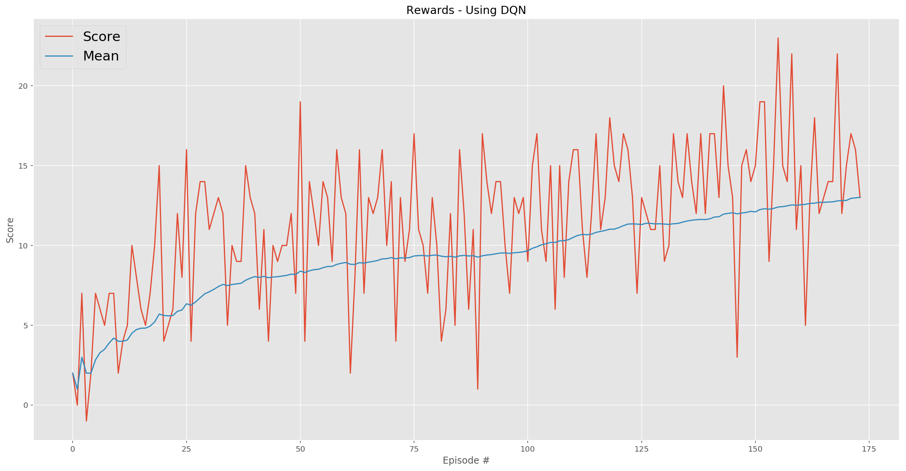
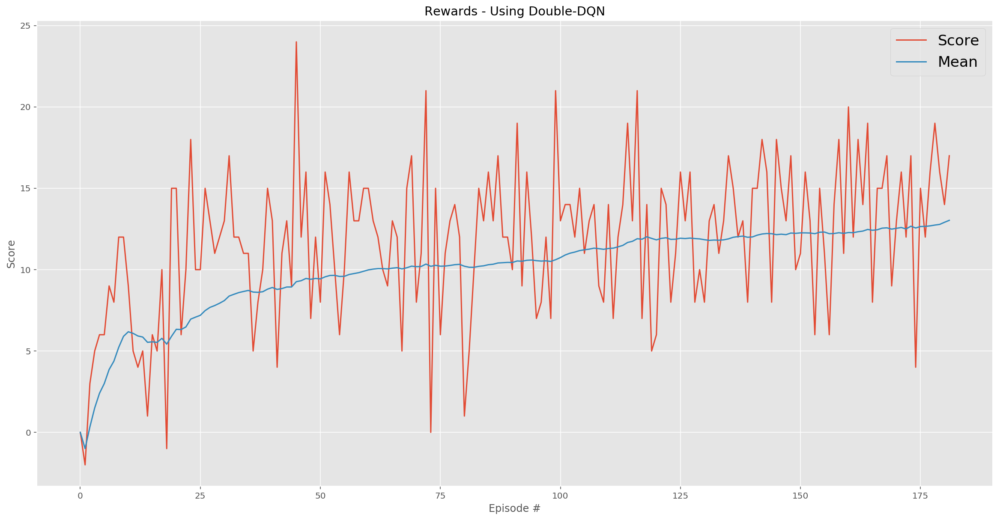

# Deep Reinforcement Learning: Navigation (Report)

[](https://twitter.com/youldash)

## License

By using this site, you agree to the **Terms of Use** that are defined in [LICENSE](https://github.com/youldash/DRL-Navigation/blob/master/LICENSE).

## Algorithm Implementations

As mentioned in the [`README.md`](https://github.com/youldash/DRL-Navigation/blob/master/README.md) file of this repo, The project was developed in partial fulfillment of the requirements for Udacity's [Deep Reinforcement Learning (DRL) Nanodegree](https://www.udacity.com/course/deep-reinforcement-learning-nanodegree--nd893) program. To solve the challenges presented therein, we explored (and implemented) a selected number of DRL algorithms. These are:

1. The [Deep Q-Network (DQN)](https://storage.googleapis.com/deepmind-media/dqn/DQNNaturePaper.pdf) algorithm.
2. The [Double-DQN](https://arxiv.org/abs/1509.06461) algorithm.
3. The [Dueling Q-Network (DN)](https://arxiv.org/abs/1511.06581) algorithm.
4. The [Prioritized Experience Replay](https://arxiv.org/abs/1511.05952) memory buffer algorithm.

## The Deep Q-Network Algorithm

Initial attempts were made for developing `model` implementations of a *value-based* method called the **Deep Q-Network (DQN)** algorithm, using Experience Replays and Fixed Q-targets (see `model.py` for more details). This model served as the *benchmark* for further experiments to come (and compare against).

### Early Attempts

- Our first `model` training configuration was based on a DQN with **two Fully-connected (FC) layers (hosting 512 nodes in each layer)**. This `model` configuration solved the virtual world (or environment) in a number of episodes that far exceeded 700. This was set as a point of reference to beat in our next attempts. The `model`'s [Neural Network (NN)](https://pathmind.com/wiki/neural-network) architecture was adjusted based on the following configuration:
```
Input nodes (37) -> FC Layer (512 nodes, ReLU activation) -> FC Layer (512 nodes, ReLU activation) -> Output nodes (4)
```

- Further attempts were made by amending the `model` architecture (*i.e.* by increasing the number of layers, as well as increasing the number of nodes in the `model`). These experiments yielded **poorer** results when compared to the **benchmark** configuration above, leading us to further adjust the `model` by having **two FC layers (having 128 nodes in the first, and 32 nodes in the second)**. This architecture solved the environment in less than 500 episodes. This architecture is summarized as the following:
```
Input nodes (37) -> FC Layer (128 nodes, ReLU activation) -> FC Layer (32 nodes, ReLU activation) -> Output nodes (4)
```
> At this point it is imperative to note that this particular `model` configuration was considered as the foundation to be used in our future tests of the agent (for further comparisons), since the results looked promising. See the [`NavigationUsingDQN.ipynb`](https://github.com/youldash/DRL-Navigation/blob/master/NavigationUsingDQN.ipynb) notebook for implementation details and the rewards (*i.e.* the results) obtained after training and testing.

### Rewards Plot

The following graph (*i.e.* plot) illustrated two measurable outcomes. These are

- the rewards per-episode within the training phase, in addition to
- the moving mean.



The trained agent, as witnesses in the accompanying   [`NavigationUsingDQN.ipynb`](https://github.com/youldash/DRL-Navigation/blob/master/NavigationUsingDQN.ipynb) notebook file, revealed the following results:

```
EPISODE 100	AVG SCORE: 9.6000	EPS: 0.0270	LEARNING RATE: [0.00022711322607504007]
EPISODE 174	AVG SCORE: 13.0200	EPS: 0.0104	LEARNING RATE: [0.00013037578502107008]

Environment solved in 74 episodes.
Average score: 13.02.
Model saved successfully.

Solved in 3.63 minutes.
```

## The Double Deep Q-Network Algorithm

After we concluded our tests using the baseline DQN algorithm, we sought to include a version of the **Double Deep Q-Network (Double-DQN)** algorithm. According to [literature](https://arxiv.org/abs/1509.06461), this approach aims to reduce the overestimations that are otherwise detected in the aforementioned approach (*i.e.* the vanilla **DQN**) while training in game simulations/environments. See `model.py` for more details.

### Attempts Using Double-DQNs

- Using the **benchmark** `model` configuration, which was revealed above, we strived to achieve better results that those obtained by the previous attempts. However, that was not the case.

- See the [`NavigationUsingDoubleDQN.ipynb`](https://github.com/youldash/DRL-Navigation/blob/master/NavigationUsingDoubleDQN.ipynb) notebook for implementation details and the rewards (*i.e.* the results) obtained after training and testing.

### Rewards Plot

The following graph illustrated the outcomes:



The trained agent, as witnesses in the accompanying   [`NavigationUsingDoubleDQN.ipynb`](https://github.com/youldash/DRL-Navigation/blob/master/NavigationUsingDoubleDQN.ipynb) notebook file, revealed the following results:

```
EPISODE 100	AVG SCORE: 10.6100	EPS: 0.0270	LEARNING RATE: [0.00022711322607504007]
EPISODE 182	AVG SCORE: 13.0300	EPS: 0.0100	LEARNING RATE: [0.00012278292199717212]

Environment solved in 82 episodes.
Average score: 13.03.
Model saved successfully.

Solved in 3.71 minutes.
```

Here, the number of episodes exceeded the **benchmark** `model` by 8 episodes.

## Parameter Tuning

TBA...
